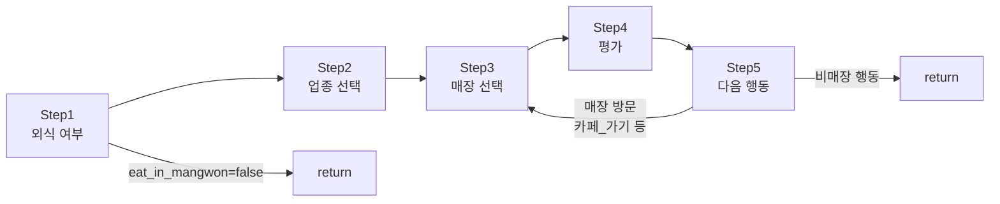

# 에이전트 의사결정 데이터 흐름 (Step 1→5 + Loop)

이 문서는 시뮬레이션 내 에이전트의 **5단계 의사결정 과정**을 구체적인 데이터 흐름 예시로 설명합니다.

> **관련 문서:** [에이전트-행동-알고리즘.md](./에이전트-행동-알고리즘.md) (알고리즘 스펙), [에이전트-레퍼런스.md](./에이전트-레퍼런스.md) (설정·코드 통합)

---

## 목차

| 단계 | 내용 |
|:---:|---|
| [아키텍처](#아키텍처-흐름도) | 전체 흐름도 및 종료 조건 |
| [Step 1](#step-1-목적지-유형-결정-llm-기반) | 외식 여부 결정 |
| [Step 2](#step-2-업종-선택-llm-기반) | 업종(카테고리) 선택 |
| [Step 3](#step-3-매장-선택-llm-기반) | 매장 선택 |
| [Step 4](#step-4-평가-및-피드백-llm-기반) | 평가 및 리뷰 |
| [Step 5](#step-5-다음-행동-결정-llm-기반) | 다음 행동 결정 |
| [Loop](#loop-매장-방문-행동이면-step-34-5-반복) | 매장 방문 시 Step 3→4→5 반복 |
| [요약](#llm-호출-횟수-요약) | 호출 횟수, 데이터 저장 |

---

## 아키텍처 흐름도



**종료 조건 요약**

| 조건 | 결과 |
|------|------|
| Step 1에서 `eat_in_mangwon = false` | Step 2 이후 미진입, **return** |
| Step 5에서 비매장 행동 (배회하기, 집에서_쉬기 등) | **return** |
| `MAX_VISIT_LOOP = 3` 초과 | **return** |

---

## 시나리오 설정

| 항목 | 값 |
|---|---|
| **에이전트** | R025 (상주 / 사적모임형 / 2인 / Y세대 / 혼성) |
| **날짜** | 수요일 |
| **시간대** | 점심 |
| **다음 시간대** | 저녁 |
| **당일 식사 기록** | 아침에 집밥 해결 → 아직 외식 0회 |

### 페르소나 (persona_summary)

```text
[R025]
- 유형: 상주 / 사적모임형 / 2인
- 세대: Y
- 성별 구성: 혼성
- 주거 유형: 다세대(빌라)

당신은 망원동에 거주하며, 이 동네가 생활의 중심입니다. 집 근처 식당들은 이미 익숙하고,
동네 분위기와 가게들의 변화를 자연스럽게 인지합니다.

당신은 새로운 경험을 적극적으로 탐색하는 성향이 강하며, 트렌드와 SNS, 리뷰에 매우 민감합니다.
소비는 단순한 식사가 아니라 하나의 경험이며, '가볼 만하다'는 느낌이 들면 일정 수준의
실패 가능성은 크게 두려워하지 않습니다.

또래와의 모임에서 술을 동반한 소비를 자주 하며, 오래 머무를 수 있는 분위기나
대화가 가능한 공간을 선호합니다.
```

---

## Step 1: 목적지 유형 결정 (LLM 기반)

> **목표**: 이 시간대에 망원동 내에서 외식할지 여부 결정

### 프롬프트 입력

**템플릿**: `src/ai_layer/prompts/step1_destination.txt`

```text
당신은 R025입니다.

[R025]
- 유형: 상주 / 사적모임형 / 2인
- 세대: Y
- 성별 구성: 혼성
- 주거 유형: 다세대(빌라)

당신은 망원동에 거주하며, 이 동네가 생활의 중심입니다...
(이하 natural_language_persona 전문)

현재 상황:
요일: 수요일
시간대: 점심

오늘의 식사 기록: 아직 없음

당신의 과거 경험:
  - 돼지야 (한식): 좋음 → "고기 퀄 좋고 된장찌개 리필 개꿀"
  - 메가MGC커피 (커피-음료): 보통 → "가성비는 좋은데 자리가 없음"
  - 반햇닭옛날통닭 (치킨): 매우좋음 → "바삭함이 미쳤음 맥주 필수"

질문: 이 시간대에 외식을 할지 결정하세요.
선택지:
1. 망원동 내 매장에서 식사한다
2. 이 시간대에는 먹지 않는다 (배가 안 고픔, 이전 식사로 충분, 다이어트 중 등)
3. 망원동 밖에서 해결한다 (집밥, 편의점, 배달 등)

판단 기준:
- 당신의 페르소나(세대, 동행 구성, 식사 취향, 예산)를 기반으로 결정하세요.
- 이전 식사 기록이 있다면 참고하되, 첫 끼니라면 자유롭게 판단하세요.
- 현실적으로 생각하세요. 대부분의 사람은 하루 2~3끼를 먹고, 매끼 외식하지는 않습니다.
- 시간대별 외식 경향: 아침은 외식률이 낮고(~40%), 점심은 가장 높으며(~70%), 저녁은 중간(~60%), 야식은 낮습니다(~20%).

반드시 아래 JSON 형식으로만 응답하세요:
{"eat_in_mangwon": true/false, "reason": "간단한 이유"}
```

### 렌더링에 사용된 변수

| 변수 | 값 | 출처 |
|---|---|---|
| `{agent_name}` | `R025` | `agent.persona_id` |
| `{persona_summary}` | 위 페르소나 전문 | `agent.get_persona_summary()` |
| `{weekday}` | `수` | 시뮬레이션 날짜에서 추출 |
| `{time_slot}` | `점심` | `TIME_SLOTS` 딕셔너리 |
| `{memory_context}` | 오늘 식사 기록 + 과거 경험 | `agent.get_memory_context(current_date)` |

### LLM 출력

```json
{"eat_in_mangwon": true, "reason": "점심이고 오늘 아직 밖에서 안 먹었으니 망원동에서 먹자"}
```

> **분기**: `eat_in_mangwon = true` → Step 2 진입 · `false` → `decision: "stay_home"` 반환 후 종료

---

## Step 2: 업종 선택 (LLM 기반)

> **목표**: 무엇을 먹을지(카테고리) 결정

### 프롬프트 입력

**템플릿**: `src/ai_layer/prompts/step2_category.txt`

```text
당신은 R025입니다.

[R025]
- 유형: 상주 / 사적모임형 / 2인
- 세대: Y
- 성별 구성: 혼성
(이하 persona_summary)

현재 상황:
- 시간대: 점심
- 선택 가능한 업종: 한식, 중식, 일식, 양식, 분식, 패스트푸드, 국밥, 찌개, 고기, 치킨, 카페, 커피, 디저트, 베이커리, 브런치
- 점심에는 다양한 식사와 카페 디저트도 고려하세요.

오늘의 식사 기록: 아직 없음

당신의 과거 경험:
  - 돼지야 (한식): 좋음 → "고기 퀄 좋고 된장찌개 리필 개꿀"
  - 메가MGC커피 (커피-음료): 보통 → "가성비는 좋은데 자리가 없음"
  - 반햇닭옛날통닭 (치킨): 매우좋음 → "바삭함이 미쳤음 맥주 필수"

질문: 어떤 업종(종류)을 선택할지 정하세요. 식사, 카페, 술자리 등 자유롭게 선택 가능합니다.
- 과거 경험에서 만족했던 업종은 재방문, 불만족했던 업종은 피하되 새로운 업종도 시도하세요.
- 같은 업종을 연속으로 먹었다면 다른 걸 선택하세요.

반드시 아래 JSON 형식으로만 응답하세요:
{"category": "선택한 업종", "reason": "선택 이유"}
```

### 렌더링에 사용된 변수

| 변수 | 값 | 출처 |
|---|---|---|
| `{available_categories}` | `한식, 중식, 일식, 양식, 분식, ...` | `TIME_SLOT_CATEGORIES["점심"]` |
| `{time_hint}` | `점심에는 다양한 식사와 카페 디저트도 고려하세요.` | `time_hints["점심"]` |
| `{memory_context}` | 오늘 식사 기록 + 과거 경험 | `agent.get_memory_context(current_date)` |

### LLM 출력

```json
{"category": "일식", "reason": "어제 고기 먹었으니 오늘은 가볍게 초밥이나 우동이 먹고 싶음"}
```

---

## Step 3: 매장 선택 (LLM 기반)

> **목표**: 선택한 카테고리 내에서 구체적인 매장 결정

### 매장 후보 필터링 로직

```text
nearby_stores (전체 매장)
  → 30개 초과: search_ranked_stores(category, sample_k=20) — Softmax 가중 샘플링
  → 30개 이하: category 매칭 필터
  → random.shuffle() — LLM 위치 편향 방지
```

### 프롬프트 입력

**템플릿**: `src/ai_layer/prompts/step3_store.txt`

```text
당신은 R025입니다.

[R025]
- 유형: 상주 / 사적모임형 / 2인
- 세대: Y
- 성별 구성: 혼성
(이하 persona_summary)

현재 상황:
- 시간대: 점심
- 원하는 업종: 일식

오늘의 식사 기록: 아직 없음

당신의 과거 경험:
  - 돼지야 (한식): 좋음 → "고기 퀄 좋고 된장찌개 리필 개꿀"
  - 메가MGC커피 (커피-음료): 보통 → "가성비는 좋은데 자리가 없음"
  - 반햇닭옛날통닭 (치킨): 매우좋음 → "바삭함이 미쳤음 맥주 필수"

주변 매장 정보:

[스시요리하루]
  store_id: ST0342
  카테고리: 일식
  평균가격: 15,000원
  주요키워드: 초밥, 런치세트, 신선도
  설명: 망원동 골목 안쪽 일식 전문점. 런치 오마카세가 인기...
  에이전트 평점: 4.2/5 (8건), 태그: 맛 5, 가성비 2, 분위기 3, 서비스 1
  리뷰 맥락: [요약] 신선한 재료와 합리적 런치 가격이 장점. 저녁은 비싸다는 의견 있음. [최근 리뷰] "런치세트 가성비 미쳤음" / "회 신선도 ㄹㅇ 좋음"

[우동카덴]
  store_id: ST0188
  카테고리: 일식
  평균가격: 9,000원
  주요키워드: 우동, 튀김, 따뜻한국물
  설명: 수제 우동 전문. 면발 쫄깃하고 국물이 시원...
  에이전트 평점: 아직 없음

[이자카야하나]
  store_id: ST0415
  카테고리: 일식
  평균가격: 22,000원
  주요키워드: 사케, 안주, 분위기
  설명: 망원역 근처 이자카야. 저녁 모임 단골...
  에이전트 평점: 3.8/5 (3건), 태그: 맛 1, 가성비 0, 분위기 3, 서비스 0
  리뷰 맥락: [요약] 분위기 좋지만 가격이 높다는 평가. [최근 리뷰] "사케 종류 다양해서 좋음"

질문: 어떤 매장을 방문할지 선택하세요.
- 과거에 방문했던 매장이 있다면, 만족했으면 재방문하고 불만족했으면 피하세요.
- 단, 항상 같은 곳만 가지 말고 새로운 매장도 탐색하세요.
- 매장 정보와 다른 에이전트들의 평점도 참고하세요.
- 페르소나 기반으로 소비 가능한 금액을 고려하세요.

반드시 아래 JSON 형식으로만 응답하세요:
{"store_name": "선택한 매장명", "reason": "선택 이유"}
```

### 렌더링에 사용된 변수

| 변수 | 값 | 출처 |
|---|---|---|
| `{category}` | `일식` | Step 2 결과 |
| `{stores_text}` | 매장별 정보 블록 (위 참고) | `_get_store_info_for_prompt(store)` × N개 |
| `{improvement_section}` | `""` (개선사항 없으면 빈 문자열) | 타겟 매장 전략 텍스트 |
| `{memory_context}` | 오늘 식사 기록 + 과거 경험 | `agent.get_memory_context(current_date)` |

### 매장 정보 포맷 (`_get_store_info_for_prompt`)

```text
[매장명]
  store_id: {store_id}
  카테고리: {category}
  평균가격: {average_price:,}원
  주요키워드: {top_keywords[:5]}
  설명: {rag_context[:150]}...
  에이전트 평점: {agent_avg_rating}/5 ({agent_rating_count}건), 태그: 맛 N, 가성비 N, 분위기 N, 서비스 N
  리뷰 맥락: {get_review_context()}    ← summary + review_buffer 통합
```

### LLM 출력

```json
{"store_name": "스시요리하루", "reason": "평점도 높고 런치세트 가성비 좋다는 리뷰가 많아서 가보고 싶음"}
```

### 검증 로직 (매장명 매칭)

```python
# 1차: 정확한 매장명 매칭
if selected_name in valid_names → return

# 2차: 부분 매칭 (LLM이 매장명을 약간 다르게 쓸 때)
for name in valid_names:
    if selected_name in name or name in selected_name → return (보정된 이름)

# 실패: LLMCallFailedError
```

---

## Step 4: 평가 및 피드백 (LLM 기반)

> **목표**: 방문한 매장에 대한 만족도 평가 + 리뷰 생성

### 프롬프트 입력

**템플릿**: `src/ai_layer/prompts/step4_evaluate.txt`

```text
당신은 R025입니다. 방금 [스시요리하루]에서 식사를 마쳤습니다.

[R025]
- 유형: 상주 / 사적모임형 / 2인
- 세대: Y
- 성별 구성: 혼성
(이하 persona_summary)

방문한 매장 정보:
[스시요리하루]
  store_id: ST0342
  카테고리: 일식
  평균가격: 15,000원
  주요키워드: 초밥, 런치세트, 신선도
  설명: 망원동 골목 안쪽 일식 전문점...
  에이전트 평점: 4.2/5 (8건), 태그: 맛 5, 가성비 2, 분위기 3, 서비스 1
  리뷰 맥락: [요약] 신선한 재료와 합리적 런치 가격... [최근 리뷰] "런치세트 가성비 미쳤음"

당신의 경험을 바탕으로 종합 평점을 매겨주세요.

[작성 가이드]
1. 말투: 밀레니얼 세대 말투로, 적당히 트렌디하면서도 정보성 있게 작성하세요.
2. 평가 관점: 아래 관점 중 당신의 페르소나에 가장 맞는 하나를 스스로 선택하여 그 관점 중심으로 평가하세요. [맛/퀄리티 / 가성비 / 매장 분위기·인테리어 / 직원 서비스·친절도 / 매장 청결·위생 / 특색있는 메뉴]
3. 구체성: 판매하는 메뉴(top_keywords 참고)나 구체적인 상황을 언급하여 리얼하게 작성하세요.

comment 작성 규칙:
- 당신의 세대, 성격, 식사 취향, 동행 구성을 반영한 개인적인 감상을 쓰세요.
- 매장 키워드나 리뷰 내용을 그대로 나열하지 마세요.
- "맛있다", "만족스럽다", "서비스가 좋다" 같은 일반적 표현 대신, 구체적인 상황이나 감정을 담으세요.
- 예시: "퇴근길에 혼자 후루룩 먹기 딱이었는데, 국물이 좀 짰다"...

평점 기준 (1~5점):
- 1점: 매우별로  2점: 별로  3점: 보통  4점: 좋음  5점: 매우좋음

평가 항목:
1. 종합 만족도 (rating): 맛, 가격, 분위기 등을 고려한 전체적인 만족도
2. 주요 장점 (selected_tags): 기준 충족 시에만 해당 태그 선택. 없으면 빈 배열 가능.
   - "맛": 맛이 기대 이상이거나 특별히 인상적일 때
   - "가성비": 가격 대비 만족도가 높을 때
   - "분위기": 인테리어·공간·조명이 방문 목적에 맞았을 때
   - "서비스": 직원 친절도나 응대가 눈에 띄게 좋았을 때

반드시 아래 JSON 형식으로만 응답하세요:
{"rating": 1~5, "selected_tags": ["맛", "가성비", "분위기", "서비스"], "comment": "한줄 평가"}
```

### 렌더링에 사용된 변수

| 변수 | 값 | 출처 |
|---|---|---|
| `{store_name}` | `스시요리하루` | Step 3 결과 |
| `{store_info}` | 매장 정보 블록 전문 | `_get_store_info_for_prompt(store)` |
| `{tone_instruction}` | `밀레니얼 세대 말투로...` | `agent.generation == "Y"` 분기 |
| `{improvement_section}` | `""` | 타겟 매장이 아니면 빈 문자열 |

### tone_instruction 분기표

| 세대 | tone_instruction |
|---|---|
| Z1, Z2 | `Z세대 말투(존나, 개꿀맛, ㅋ, 이모티콘 등)를 사용해서 친구한테 말하듯이 아주 솔직하고 짧게 작성하세요.` |
| Y | `밀레니얼 세대 말투로, 적당히 트렌디하면서도 정보성 있게 작성하세요.` |
| X | `X세대 말투로, 점잖으면서도 꼼꼼하게 분석하듯이 작성하세요.` |
| S | `어르신 말투로, 구체적이고 진중하게 작성하세요.` |

### 평가 관점 (LLM 자율 선택)

프롬프트에 6개 관점 제시, LLM이 페르소나에 맞는 하나를 스스로 선택: `맛/퀄리티`, `가성비`, `매장 분위기·인테리어`, `직원 서비스·친절도`, `매장 청결·위생`, `특색있는 메뉴`

### LLM 출력

```json
{
  "rating": 4,
  "selected_tags": ["맛"],
  "comment": "런치 오마카세 너무 괜찮았음. 밥 위에 올라간 생선이 입에서 녹는 느낌이고 가격 대비 퀄리티 꽤 좋은 편. 같이 간 남친도 만족해서 재방문 의사 있음."
}
```

### Step 4 후처리

```python
# 1. GlobalStore 평점 버퍼에 추가 (다음 타임슬롯에 반영)
global_store.add_pending_rating(
    store_name="스시요리하루",
    agent_id=25, agent_name="R025",
    rating=4, selected_tags=["맛"],
    visit_datetime="2026-02-19T12:00:00",
    comment="런치 오마카세 너무 괜찮았음..."
)

# 2. 에이전트 메모리(recent_history)에 추가
agent.add_visit(
    store_name="스시요리하루", category="일식",
    taste_rating=4, value_rating=4, atmosphere_rating=4,
    visit_datetime="2026-02-19T12:00:00",
    comment="런치 오마카세 너무 괜찮았음..."
)
```

---

## Step 5: 다음 행동 결정 (LLM 기반)

> **목표**: 식사 후 다음 시간대까지 무엇을 할지 결정

### 선택지 (에이전트 유형별 분기)

| 행동 | 상주 | 유동 | 매장 방문 여부 |
|---|:---:|:---:|:---:|
| `집에서_쉬기` | O | X | - |
| `카페_가기` | O | O | **O** (→ Loop) |
| `배회하기` | O | O | - |
| `한강공원_산책` | O | O | - |
| `망원시장_장보기` | O | O | - |
| `회사_가기` | O | X | - |
| `망원동_떠나기` | X | O | - |

### 프롬프트 입력

**템플릿**: `src/ai_layer/prompts/step5_next_action.txt`

```text
당신은 R025입니다.

[R025]
- 유형: 상주 / 사적모임형 / 2인
- 세대: Y
- 성별 구성: 혼성
(이하 persona_summary)

현재 상황:
- 요일: 수요일
- 현재 시간대: 점심
- 다음 시간대: 저녁

이번 시간대 활동:
  1. 스시요리하루(일식) 방문 -> 4/5

오늘의 식사 기록 (현재 1끼 외식 완료):
  - 12:00 스시요리하루 (일식)

당신의 과거 경험:
  - 돼지야 (한식): 좋음 → "고기 퀄 좋고 된장찌개 리필 개꿀"
  - 메가MGC커피 (커피-음료): 보통 → "가성비는 좋은데 자리가 없음"
  - 반햇닭옛날통닭 (치킨): 매우좋음 → "바삭함이 미쳤음 맥주 필수"
  - 스시요리하루 (일식): 좋음 → "런치 오마카세 너무 괜찮았음..."

질문: 위 활동 이력을 고려하여, 다음 시간대까지 무엇을 할지 결정하세요.
참고: 같은 종류의 매장(예: 카페)을 연속으로 방문하는 것은 일반적이지 않지만, 특별한 이유가 있다면 가능합니다. 다양성을 추구하는 것이 좋습니다.

선택 가능한 행동:
- 집에서_쉬기: 집에 돌아가서 휴식
- 카페_가기: 근처 카페에서 시간 보내기
- 배회하기: 망원동 거리를 걸으며 구경하기
- 한강공원_산책: 망원한강공원에서 산책
- 망원시장_장보기: 망원시장에서 장보기
- 회사_가기: 직장에 출근하기 (직장인만)

또한 당신의 걷는 속도(km/h)를 결정하세요. 위의 페르소나 특징(나이, 건강 상태, 가족 구성, 성격, 직업 등)을 종합적으로 고려하여 자연스러운 걷는 속도를 판단하세요.

반드시 아래 JSON 형식으로만 응답하세요:
{"action": "집에서_쉬기|카페_가기|배회하기|한강공원_산책|망원시장_장보기|회사_가기", "walking_speed": 숫자(km/h), "reason": "간단한 이유"}
```

### 렌더링에 사용된 변수

| 변수 | 값 | 출처 |
|---|---|---|
| `{current_time_slot}` | `점심` | 현재 타임슬롯 |
| `{next_time_slot}` | `저녁` | 다음 타임슬롯 |
| `{weekday}` | `수` | 시뮬레이션 날짜 |
| `{session_activity}` | `1. 스시요리하루(일식) 방문 -> 4/5` | `session_visits` 리스트에서 동적 생성 |
| `{memory_context}` | 오늘 식사 기록 + 과거 경험 | `agent.get_memory_context(current_date)` |
| `{available_actions}` | 상주/유동 분기된 선택지 | `agent.is_resident` 분기 |
| `{action_options}` | `집에서_쉬기\|카페_가기\|...` | `"\|".join(valid_actions)` |

### LLM 출력

```json
{"action": "카페_가기", "walking_speed": 4.5, "reason": "초밥 먹었으니 식후 커피 한 잔 하면서 여유롭게 시간 보내고 싶음"}
```

> **분기**: `action`이 `STORE_VISIT_ACTIONS`에 있으면 (예: 카페_가기) → **Loop 진입** · 없으면 (배회하기 등) → **return (사이클 종료)**

---

## Loop: 매장 방문 행동이면 Step 3→4→5 반복

> `STORE_VISIT_ACTIONS = {"카페_가기": "커피-음료"}`
> Step 5에서 `카페_가기`를 선택했으므로 `loop_category = "커피-음료"`로 자동 설정

### Loop 1 — Step 3 (매장 선택)

카테고리가 `커피-음료`로 강제 설정된 상태에서 Step 3 재실행

```json
// LLM 출력
{"store_name": "딥블루레이크", "reason": "분위기 좋은 카페에서 커피 마시면서 쉬고 싶음"}
```

### Loop 1 — Step 4 (평가)

```json
// LLM 출력
{
  "rating": 5,
  "selected_tags": ["분위기"],
  "comment": "인테리어가 진짜 감성적이고 라떼 맛도 부드러움. 남친이랑 와서 사진도 찍고 여유로운 시간 보냄."
}
```

### Loop 1 — Step 5 (다음 행동)

이제 `session_activity`가 업데이트됩니다:

```
이번 시간대 활동:
  1. 스시요리하루(일식) 방문 -> 4/5
  2. 딥블루레이크(커피-음료) 방문 -> 5/5
  [고려사항] 방금 카페를 다녀왔습니다. 보통 바로 또 카페를 가지는 않지만, 분위기가 다른 곳으로 2차를 가야 할 특별한 이유가 있다면 가능합니다.
```

**`[고려사항]` 주입 조건** (동적 경고):

```python
# 동일 카테고리 연속 방문 시 경고 문구 주입
from collections import Counter
cat_counts = Counter(visited_categories)  # {"일식": 1, "커피-음료": 1}

# 커피-음료 1회 → 카페 경고 주입
if cat == "커피-음료" and count >= 1:
    "[고려사항] 방금 카페를 다녀왔습니다..."

# 아무 카테고리 2회 이상 → 강한 경고 주입
if count >= 2:
    "[고려사항] '{cat}' 일정을 이미 {count}번 소화했습니다. 3번 연속은 부자연스럽습니다..."
```

```json
// LLM 출력
{"action": "한강공원_산책", "walking_speed": 4.0, "reason": "배도 부르고 커피도 마셨으니 소화시킬 겸 한강에서 좀 걷자"}
```

> **분기**: `action = "한강공원_산책"` → `STORE_VISIT_ACTIONS`에 없음 → **Loop 종료**

---

## Loop 종료 조건 정리

| 조건 | 결과 |
|---|---|
| Step 5 action이 `STORE_VISIT_ACTIONS`에 없음 | Loop 종료 (가장 흔한 케이스) |
| `_loop_i >= MAX_VISIT_LOOP` (3회) | Loop 강제 종료 |
| Loop 내 Step 3/4/5 LLM 호출 실패 | Loop 종료 (이전 방문은 유지) |
| Loop 내 Step 3 매장 선택 실패 (매장 없음) | Loop 종료 |

---

## 최종 반환값 (`process_decision`)

```json
{
    "decision": "visit",
    "visits": [
        {
            "visited_store": "스시요리하루",
            "visited_category": "일식",
            "ratings": {"taste": 4, "value": 4, "atmosphere": 4},
            "steps": {"step3": {...}, "step4": {...}},
        },
        {
            "visited_store": "딥블루레이크",
            "visited_category": "커피-음료",
            "ratings": {"taste": 5, "value": 5, "atmosphere": 5},
            "steps": {"step3": {...}, "step4": {...}},
        },
    ],
    "visited_store": "스시요리하루",       # 첫 번째 방문 (하위 호환)
    "visited_category": "일식",
    "ratings": {"taste": 4, "value": 4, "atmosphere": 4},
    "step5": {                              # 마지막 Step 5 결과
        "action": "한강공원_산책",
        "walking_speed": 4.0,
        "reason": "배도 부르고 커피도 마셨으니...",
        "destination": {
            "type": "park",
            "name": "망원한강공원",
            "lat": 37.5530,
            "lng": 126.8950,
        },
    },
    "steps": {"step1": {...}, "step2": {...}},
    "error": None,
}
```

---

## LLM 호출 횟수 요약

| 시나리오 | Step 1 | Step 2 | Step 3 | Step 4 | Step 5 | 합계 |
|---|:---:|:---:|:---:|:---:|:---:|:---:|
| 외식 안 함 (stay_home) | 1 | - | - | - | - | **1** |
| 1회 방문 후 비매장 행동 | 1 | 1 | 1 | 1 | 1 | **5** |
| 1회 방문 + 카페 1회 (위 예시) | 1 | 1 | 2 | 2 | 2 | **8** |
| 1회 방문 + 카페 2회 | 1 | 1 | 3 | 3 | 3 | **11** |
| 최대 (1+3 추가 방문) | 1 | 1 | 4 | 4 | 4 | **14** |

---

## 데이터 저장 흐름

```text
Step 4 평가 완료
  ├── GlobalStore.pending_ratings 버퍼에 추가 (즉시)
  ├── agent.recent_history에 추가 (즉시, 최대 15개 유지)
  │
  └── 타임슬롯 종료 시:
      └── flush_and_summarize_async()
          ├── pending_ratings → agent_ratings 반영 (flushed)
          ├── review_buffer에 comment 추가
          └── review_buffer ≥ 10개 → LLM 요약 → summary 갱신 + buffer 비움 (summarized)
```

### CSV 기록 (`agent_task`)

`visits` 리스트를 순회하며 **방문당 1개 레코드** 생성:

```text
agent_id, store_name, category, rating, comment, visit_datetime, ...
R025, 스시요리하루, 일식, 4, "런치 오마카세...", 2026-02-19T12:00:00
R025, 딥블루레이크, 커피-음료, 5, "인테리어가 진짜 감성적...", 2026-02-19T12:00:00
```
